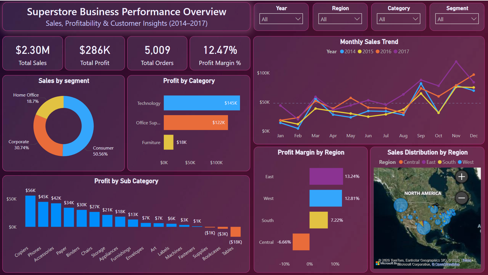

# Superstore Sales Analysis Dashboard (Power BI)

## Business Intelligence Project | Sales & Profitability Analysis

This project presents an interactive **Power BI dashboard** analyzing Superstore sales performance across **products, regions, customer segments, and time**.  
The objective is to identify **key revenue drivers, loss-making categories, seasonal trends, and regional profitability** to support data-driven business decisions.

---

# Dashboard Preview

---

# Project Objective

The objective of this analysis is to:

- Analyze overall **sales and profit performance**
- Identify **high-performing and loss-making product categories**
- Understand **customer segment contribution**
- Detect **seasonal sales patterns**
- Evaluate **regional profitability**

---

# Key Business Insights

- **Technology** generates the highest profit (~$145K), significantly outperforming other categories.
- **Tables** is the most unprofitable sub-category (~-$18K), indicating potential pricing or discounting issues.
- **Consumer segment** contributes more than **50% of total sales**, making it the primary revenue driver.
- Sales consistently **peak in Q4 (Oct–Dec)**, highlighting strong seasonal demand.
- **Central region operates at a negative profit margin (~-6.6%)**, suggesting inefficiencies in pricing or operational costs.

---

# Dashboard Features

The Power BI dashboard includes:

### KPI Cards
- Total Sales
- Total Profit
- Total Orders
- Profit Margin %

### Interactive Filters
- Year
- Region
- Category
- Segment

### Visual Insights
- Monthly Sales Trend
- Sales by Segment
- Profit by Category
- Profit by Sub-Category
- Profit Margin by Region
- Sales Distribution by Region (Map)

---

# Project Workflow

The analysis was completed using the following steps:

### 1️⃣ Data Collection
Superstore dataset containing sales transactions across regions and products.

### 2️⃣ Data Cleaning & Exploration
Performed exploratory analysis using **Excel and SQL** to identify trends and anomalies.

### 3️⃣ Data Modeling
Created **DAX measures** in Power BI including:

- Total Sales = SUM(Sales)
- Total Profit = SUM(Profit)
- Profit Margin % = Total Profit / Total Sales
- Total Orders = DISTINCTCOUNT(Order ID)

### 4️⃣ Dashboard Development
Designed an **interactive dashboard** with multiple visuals and slicers to allow dynamic filtering.

### 5️⃣ Business Insights
Extracted insights to identify **profit drivers, loss areas, and growth opportunities**.

---

# Tools & Technologies Used

- **Power BI Desktop**
- **SQL**
- **Excel**
- **DAX (Data Analysis Expressions)**
- **Data Visualization Best Practices**

---

# Dataset Details

- Dataset: Superstore Sales Dataset  
- Time Period: **2014 – 2017**  
- Total Orders: **5009**  
- Total Sales: **~$2M**  
- Total Profit: **~$286K**  
- Regions Covered: **Central, East, South, West**

---

# How to Use This Project

1. Download the `.pbix` file from the **dashboard** folder.
2. Open the file using **Power BI Desktop**.
3. Interact with the dashboard using filters and visuals.

---

# Future Improvements

- Discount impact analysis
- Customer segmentation analysis
- Sales forecasting using time-series models
- Advanced KPI performance tracking

---

# Connect With Me

If you have feedback or suggestions, feel free to connect!

**LinkedIn:**  
www.linkedin.com/in/kajolwarudkar

---

# If you found this project useful

⭐ Star the repository  
💬 Share feedback  
🔗 Connect with me on LinkedIn

